# Functional Domain Model

## Status and purpose

This document is the canonical **language-neutral functional domain model** for Wilson Shipwrecked.

It translates the accepted product, behavioral, state, contract, orchestration and mutation-authority decisions into concrete domain concepts that can later be implemented in GDScript, C#, or another runtime without changing their meaning.

This model is concrete about:

- aggregates and ownership boundaries;
- entities, value objects and definition/runtime separation;
- world state and actor/body state;
- properties, capabilities and categories;
- generic interactions, predicates, effects and transformations;
- containers, inventory and spatial relationships;
- Wilson cognition and persistent personal history;
- non-Wilson autonomous actors;
- projects, events and directed opportunities;
- player intervention, profile, Legacy Knowledge and Diary;
- Luck;
- run lifecycle;
- deterministic contracts and traceability.

It intentionally does **not** choose:

- GDScript versus C#;
- persistence technology;
- Godot node/resource layout;
- exact numeric formulas;
- concrete collection/index types;
- content-authoring serialization format.

The companion `DOMAIN_REGRESSION.md` validates this model against the representative scene catalog. `DOMAIN_SCHEMA.dbml` is a relational-style projection for visualization only; it is not a database mandate.

---

# 1. Domain boundaries

The runtime domain is divided into six authority families plus derived services.

```text
Run
├── World
│   ├── entities / locations / containers
│   ├── environment / weather / time
│   ├── WilsonBody
│   └── non-Wilson actor runtime state
├── WilsonCognition
├── Projects
├── Director
├── PlayerRunState
└── ActionExecution

PlayerProfile
├── LegacyKnowledge
├── DiaryArchive
├── LifetimeStatistics
└── GlobalUnlocks
```

Derived services do not own durable truth:

```text
Perception
Salience
Expectation
Affordance derivation
Candidate intention generation
Intention evaluation / competition
Causal attribution
Reaction / transient emotion
Learning proposal derivation
Luck evaluation
```

## 1.1 Core ownership rule

Every durable state family has one normal mutation owner.

A service may read state and produce a semantic proposal/result, but it does not gain ownership of the store it influences.

---

# 2. Identity and semantic vocabulary

Domain identity must not depend on Godot nodes, scene paths, display strings or asset filenames.

Use stable semantic IDs conceptually equivalent to:

```text
EntityId
EntityTypeId
ActorProfileId
PlaceId
RegionId
CategoryId
PropertyId
CapabilityId
RelationTypeId
ActionId
RoleId
InteractionRuleId
TransformationId
KnowledgeId
SemanticIntentionId
ProjectDefinitionId
ProjectInstanceId
EventDefinitionId
EventInstanceId
InterventionCapabilityId
RunId
EpisodeId
DecisionId
ActionExecutionId
OutcomeId
ObservationId
LearningBatchId
PlayerProfileId
AchievementId
UnlockId
```

Rules:

- authored IDs are stable across compatible releases;
- runtime instance IDs are unique within their scope;
- presentation names are not identity;
- registries validate references before simulation begins;
- domain references never contain Godot object/node references.

---

# 3. Core value objects

## 3.1 Bounded numbers

```text
UnitInterval   // [0,1]
SignedUnit     // [-1,+1]
Probability    // [0,1]
FiniteScalar   // finite numeric value
NonNegative    // finite >= 0
Duration       // finite >= 0
```

NaN, infinity and giant sentinel priorities are invalid domain values.

## 3.2 Ordered grades

Use finite ordered grades where exact physical precision is unnecessary.

```text
Grade5 = VERY_LOW | LOW | MEDIUM | HIGH | VERY_HIGH
```

Examples:

```text
hardness
break_resistance
flammability
weight_class
impact_capacity
```

Do not force every property into `Grade5`; use booleans, counts or bounded scalars when semantics demand them.

## 3.3 PropertyValue

```text
PropertyValue =
    BoolValue
  | IntValue
  | ScalarValue
  | GradeValue
  | SemanticIdValue
```

Authoritative definitions/state must not use unrestricted arbitrary executable values.

## 3.4 SubjectRef

Persistent Wilson-relative state needs stable subjects at several scopes.

```text
SubjectRef =
    Entity(EntityId)
  | EntityType(EntityTypeId)
  | Category(CategoryId)
  | Place(PlaceId)
  | Region(RegionId)
  | Project(ProjectInstanceId)
  | Presence
  | SemanticConcept(SemanticId)
```

This supports `Gerald`, `this fire pit`, `that tide pool`, `mushrooms`, `the unseen presence`, and an unfinished project without inventing separate relationship systems.

---

# 4. Definition versus runtime instance

Static authored content and mutable runtime state are separate.

```text
EntityDefinition       != EntityInstance
ActionDefinition       != ActionExecution
ProjectDefinition      != ProjectInstance
EventDefinition        != EventInstance
InteractionRule        != ResolvedInteraction
```

Definitions describe semantic possibility. Instances describe one current world/run occurrence.

---

# 5. World aggregate

```text
WorldState
  simulation_time: SimulationTime
  entities: EntityStore
  places: PlaceStore
  relations: WorldRelationStore
  environment: EnvironmentState
  actors: ActorRuntimeStore
  wilson_body: WilsonBodyState
```

The world is authoritative about physical facts. Wilson cognition may contain a different or incomplete model of those facts.

## 5.1 EntityDefinition

```text
EntityDefinition
  id: EntityTypeId
  categories: Set<CategoryId>
  base_properties: Map<PropertyId, PropertyValue>
  capabilities: Set<CapabilityId>
  intervention_capabilities: Set<InterventionCapabilityId>
  anchors: Set<AnchorId>
  actor_profile_id: optional ActorProfileId
```

Example:

```text
stone:
  hardness = HIGH
  weight_class = MEDIUM
  capabilities = {impact_tool, throwable}

coconut:
  break_resistance = LOW
  capabilities = {receives_impact, carryable}
```

## 5.2 EntityInstance

```text
EntityInstance
  id: EntityId
  type_id: EntityTypeId
  place_id: PlaceId
  transform: SpatialTransform
  state_overrides: Map<PropertyId, PropertyValue>
  quantity: optional NonNegative
  lifecycle: ACTIVE | DESTROYED | TRANSFORMED | REMOVED
```

Effective property lookup:

```text
instance override
?? definition base value
?? absent
```

Do not copy every authored property onto every runtime instance.

## 5.3 Place and region

A place is a stable semantic spatial subject; a region is a broader grouping.

```text
PlaceDefinition
  id: PlaceId
  region_id: RegionId
  categories: Set<CategoryId>
  base_properties: Map<PropertyId, PropertyValue>

PlaceState
  id: PlaceId
  state_overrides: Map<PropertyId, PropertyValue>
```

Examples:

```text
place.camp
place.favorite_rock_area
place.gerald_tide_pool
place.sandy_slope
place.neighbor_island
place.wreck_deck
```

Stable places allow spatial history without persisting arbitrary coordinate snapshots in Wilson cognition.

## 5.4 World relations

Many scenes depend on semantic relations rather than object-local properties.

```text
WorldRelation
  type: RelationTypeId
  subject: SubjectRef
  object: SubjectRef
  qualifier: optional PropertyValue
```

Examples:

```text
inside(item, container)
on_top_of(spoon, rock)
attached_to(garment, clothesline)
part_of(lid, container)
blocks(clutter, escape_route)
near(firewood, firepit)
owned_carried_by(coconut, wilson)
```

Relations are world truth. Wilson may or may not know them.

## 5.5 Containers and carried state

Container/inventory truth is represented through capabilities + relations rather than a separate universal inventory abstraction.

A container typically has:

```text
capability.container
property.capacity_class
```

Contents are world relations:

```text
inside(entity, container)
```

Wilson carried/held objects use relations such as:

```text
carried_by(entity, wilson)
held_in_hand(entity, left/right)
```

This keeps storage, hand occupancy and unusual carriers queryable through one world model.

---

# 6. Wilson body and physical condition

Wilson cognition is not authoritative about Wilson's physical body.

```text
WilsonBodyState
  alive: bool
  vitality: UnitInterval
  exertion: UnitInterval
  wetness: UnitInterval
  mobility: MobilityState
  conditions: BodyCondition[]
```

```text
BodyCondition
  condition_id: SemanticId
  severity: UnitInterval
  source_subject: optional SubjectRef
  started_at: SimulationTime
  recovery: RecoveryPolicy
```

Examples:

```text
burned_hand
bruised
injured_ankle
poisoned
cold/wet discomfort source
```

Rules:

- Action Resolution/world effects mutate authoritative body state;
- cognition only perceives/interprets its accessible consequences;
- death derives from grounded body/world consequences;
- resurrection normalizes/restores body state according to product rules while preserving admitted cognitive learning.

`hunger`, `energy`, `comfort` and `stimulation` remain cognition/drive state because they are motivational state, not a replacement for physical condition.

---

# 7. Non-Wilson autonomous actors

Animals do not need Wilson-level cognition, but recurring individuals need persistent identity and simple behavior continuity.

```text
ActorProfileDefinition
  id: ActorProfileId
  behavior_capabilities: Set<CapabilityId>
  behavior_rules: Set<BehaviorRuleId>
  persistence_class: EPISODIC | RECURRING
```

```text
ActorRuntimeState
  entity_id: EntityId
  profile_id: ActorProfileId
  current_activity: optional SemanticActivityId
  target: optional SubjectRef
  transient_state: bounded semantic values
```

Important:

- Gerald's psychological meaning lives in **Wilson's** associations/beliefs/habits;
- Gerald only needs enough autonomous behavior to approach food, roam, flee, steal, etc.;
- recurring animals preserve `EntityId` across appearances when narratively required;
- do not create a deep animal memory/personality model unless later scenes require it.

---

# 8. Environment and world evolution

```text
EnvironmentState
  weather: WeatherState
  daylight_phase: DaylightPhase
  active_environmental_processes: EnvironmentalProcess[]
```

```text
EnvironmentalProcess
  kind: SemanticId
  subject: SubjectRef
  started_at: SimulationTime
  parameters: bounded semantic values
```

Examples:

```text
fruit_ripening
food_spoilage
wet_item_drying
fire_fuel_consumption
storm_weakening_palm
wave_washing_object
wind_moving_loose_object
```

Processes are reusable world evolution rules, not authored scenes.

---

# 9. Generic interaction grammar

## 9.1 ActionDefinition

```text
ActionDefinition
  id: ActionId
  roles: RoleDefinition[]
  interruption_class: IMMEDIATE_SAFE | CHECKPOINT | COMMITTED_ATOMIC
```

Example:

```text
action.hit(actor, target, tool)
action.put(actor, item, container)
action.throw(actor, item, target)
action.inspect(actor, target)
action.eat(actor, food)
```

Actions define reusable verbs, not target-specific recipes.

## 9.2 RoleBinding

```text
RoleBinding
  role_id -> SubjectRef
```

A binding may be partial during affordance generation and complete before action resolution.

---

# 10. Predicate algebra

Eligibility, applicability and authored prerequisites use one validated predicate vocabulary.

Minimum predicate forms:

```text
HasCapability(role, capability)
HasCategory(role, category)
PropertyExists(role, property)
PropertyCompare(role.property, operator, literal)
PropertyCompareRoles(left.property, operator, right.property)
RelationExists(type, subject, object)
RelationAbsent(type, subject, object)
SpatialPredicate(a, relation, b)
KnowledgePredicate(actor, knowledge)
BeliefPredicate(actor, proposition-pattern)
AssociationPredicate(actor, subject, threshold/polarity)
HabitPredicate(actor, cue/intention-pattern, threshold)
DrivePredicate(actor, drive, comparison)
ProjectPredicate(project-pattern)
EnvironmentPredicate(environment semantic condition)
ContextPredicate(registered semantic predicate id)
AllOf(...)
AnyOf(...)
Not(...)
```

Rules:

- predicates are data/registered semantics, not arbitrary authored executable scripts;
- not every predicate category is valid in every context;
- physical legality rules should avoid cognition predicates unless the action is intentionally knowledge-gated;
- Director/project eligibility may legitimately use Wilson-relative history/knowledge through explicit bounded queries.

---

# 11. Interaction rules and property-driven crafting

```text
InteractionRuleDefinition
  id: InteractionRuleId
  action_id: ActionId
  requirements: RequirementPredicate
  resolution: ResolutionSpec
  discovery: optional DiscoverySpec
```

The generic model is:

```text
semantic roles
+ participant capabilities
+ properties
+ world relations/context
→ semantic outcome
```

Not:

```text
specific object pair
→ recipe result
```

Example:

```text
rule.break_by_impact

requires:
  tool has impact_tool
  target has receives_impact
  tool.hardness >= target.break_resistance

resolves:
  emit semantic outcome sufficient_breaking_impact
```

Stone, hammer, bowling ball or future compatible tools can satisfy the same rule.

---

# 12. Resolution and effects

```text
ResolutionSpec
  outcome_classifier
  effect_specs: EffectSpec[]
  semantic_outcome_tags: SemanticOutcomeTag[]
```

Minimum resolved outcome classes:

```text
SUCCESS
PARTIAL
NO_EFFECT
BLOCKED
FAILURE
```

Minimum effect families:

```text
TransformEntity
ModifyProperty
CreateRelation
RemoveRelation
MoveEntity
TransferQuantity
CreateEntity
DestroyEntity
ApplyBodyEffect
EmitWorldSemanticEvent
ScheduleEnvironmentalProcess
```

Avoid a generic `execute_script` authoritative effect.

## 12.1 Partial/diagnostic results

`Scientific Method` requires physical failure to still provide meaningful feedback.

```text
ActionOutcome
  classification
  resolved_effects
  semantic_outcome_tags
  diagnostic_feedback
  consequence_severity
```

Examples of diagnostic feedback:

```text
wood_broke_before_container_changed
container_dented
lid_shifted
material_too_soft
partial_progress
```

Learning can use these semantics to refine the next experiment without inventing hidden information.

---

# 13. Transformations

```text
TransformationDefinition
  id: TransformationId
  source_requirements: RequirementPredicate
  trigger_tags: Set<SemanticOutcomeTag>
  result_type: EntityTypeId
  transfer_policy: TransferPolicy
```

Example:

```text
coconut
+ sufficient_breaking_impact
→ opened_coconut
```

The generic interaction decides that sufficient impact happened; the transformation decides how this particular content form changes.

`TransferPolicy` explicitly controls:

```text
location
quantity
container/carried relations
selected instance continuity/history link
whitelisted state properties
```

Do not copy arbitrary state wholesale.

---

# 14. Affordance model

```text
Affordance
  action_id: ActionId
  partial_binding: RoleBinding
  missing_roles: RoleId[]
  source_rule_ids: InteractionRuleId[]
  mode: EXPLORATORY | LEARNED_SEMANTIC | DIRECT_PHYSICAL
```

An affordance means materially possible enough to consider or complete binding, not that Wilson wants it.

Affordance derivation must be locally bounded. Never enumerate every entity × action × entity combination globally.

---

# 15. Wilson cognition aggregate

```text
WilsonCognitionState
  traits: TraitProfile
  drives: DriveState
  beliefs: BeliefStore
  associations: AssociationStore
  habits: HabitStore
  episodes: EpisodeStore
  intentions: IntentionalState
  presence: PresenceRelationship
```

## 15.1 Traits

```text
TraitProfile
  curiosity: UnitInterval
  risk_tolerance: UnitInterval
  independence: UnitInterval
```

Traits are stable dispositions, not ordinary learned state.

## 15.2 Drives

```text
DriveState
  hunger_urgency: UnitInterval
  energy_need: UnitInterval
  discomfort: UnitInterval
  stimulation_need: UnitInterval
```

Names encode directionality: higher means stronger motivational pressure.

## 15.3 Belief/knowledge model

A belief store contains proposition-like entries rather than one knowledge percentage per object.

```text
BeliefEntry
  proposition: Proposition
  confidence: UnitInterval
  source_accessibility: SourceAccessibility
```

```text
Proposition
  predicate: SemanticPredicateId
  arguments: SubjectRef[]
  qualifiers: bounded semantic values
```

This can express:

```text
mushroom_type_X may_be_harmful
this_firepit often_fails_to_light
spoon expected_at cooking_area
Gerald likely_targets food
stone_category expected_hard
```

`KnowledgeEntry` is a high-confidence/operational subset where useful; implementation may use one store with semantic classification rather than physically separate databases.

## 15.4 Learned semantic interactions

```text
SemanticInteractionDefinition
  knowledge_id: KnowledgeId
  intention_id: SemanticIntentionId
  applicability: RequirementPredicate
  legacy_eligible: bool
  legacy_weight: NonNegative
```

Knowledge exposes purposeful intentions such as:

```text
open coconut with impact tool
cook food at heat source
```

but never bypasses authoritative physical validation.

## 15.5 Associations

```text
AssociationEntry
  subject: SubjectRef
  valence: SignedUnit
  attachment: UnitInterval
```

This supports liking, hatred, rivalry and emotionally important negative relationships without separate primitives.

## 15.6 Episodic history

```text
Episode
  id: EpisodeId
  time: SimulationTime
  subjects: SubjectRef[]
  event_kind: SemanticEventId
  context_place: optional PlaceId
  expected_outcome: optional OutcomeSummary
  observed_outcome: OutcomeSummary
  meaningful_choice: optional ChoiceSummary
  importance: UnitInterval
  source_accessibility: SourceAccessibility
```

Only selected meaningful episodes persist.

## 15.7 Habits

```text
HabitEntry
  cue: HabitCue
  intention_pattern: SemanticIntentionId
  subject_pattern: optional SubjectPattern
  strength: UnitInterval
```

```text
HabitCue
  semantic_context: SemanticCueId
  optional place/subject/time/environment qualifiers
```

Habits are biases, not commands.

## 15.8 Expected arrangements and locations

No separate `ownership` or `routine` primitive is required.

Expected arrangements are beliefs with spatial/relation propositions:

```text
expected_relation(spoon, beside, cooking_area)
expected_relation(favorite_rock, at, usual_place)
expected_relation(materials, inside, storage)
```

This allows Missing Spoon, Moved Rock and Sabotaged Storage to use the ordinary belief/prediction-error pipeline.

## 15.9 Presence relationship

```text
PresenceRelationship
  presence_belief: UnitInterval
  trust: SignedUnit
  dependency: UnitInterval
```

Private player intent never updates these directly.

---

# 16. Intentions and decision state

```text
IntentionalState
  current: optional IntentionInstance
  suspended: bounded IntentionInstance[]
```

```text
IntentionInstance
  id: IntentionId
  semantic_intention: SemanticIntentionId
  subjects: RoleBinding
  origin: IntentionOrigin
  commitment: NONE | PREPARING | COMMITTED
  started_at: SimulationTime
  continuation_context: bounded semantic refs
```

Derived candidate/evaluation data is not canonical state.

Candidate intentions may come from:

```text
drives
known interactions
exploration affordances
habits
projects
suspended interests
player suggestions
Director opportunities
current transient reaction
```

---

# 17. Reaction and transient emotion

Transient emotion is derived from current evidence/history and is not long-lived canonical memory.

```text
ReactionState
  kind: FEAR | ANGER | JOY_EXCITEMENT | CONCERN | SURPRISE | FRUSTRATION | RELIEF
  intensity: UnitInterval
  subject: optional SubjectRef
  expires/clears by semantic condition
```

If persistence across save during an active scene is required, store only the minimal current reaction continuation; long-term consequences belong in beliefs/associations/habits/episodes.

---

# 18. Projects

```text
ProjectDefinition
  id: ProjectDefinitionId
  eligibility: RequirementPredicate
  contribution_patterns: ProjectContributionSpec[]
  completion: RequirementPredicate
  abandonment_policy: semantic policy id
```

```text
ProjectInstance
  id: ProjectInstanceId
  definition_id: ProjectDefinitionId
  lifecycle: ACTIVE | PAUSED | COMPLETED | ABANDONED
  subject_bindings: RoleBinding
  metadata: bounded project semantic values
```

World physical state remains authoritative for constructed components.

Examples:

```text
roof stage sections → world entities/relations
project lifecycle → ProjectInstance
```

History can make an authored project eligible:

```text
high attachment to Gerald
+ comfortable/stimulated context
+ statue project content available
→ Gerald statue project candidate
```

The project form is authored; its contextual subject and motivation can be systemic.

---

# 19. Event / Scene Director domain

Directed content is represented as opportunities, not scripts controlling Wilson.

```text
EventDefinition
  id: EventDefinitionId
  eligibility: RequirementPredicate
  rarity/cooldown policy
  setup effects/opportunities
  candidate biases: bounded BiasSpec[]
  completion/expiry predicates
```

```text
EventInstance
  id: EventInstanceId
  definition_id: EventDefinitionId
  lifecycle: ELIGIBLE | ACTIVE | RESOLVED | EXPIRED
  bindings: RoleBinding
  started_at: SimulationTime
  state: bounded semantic values
```

The Director may:

- introduce a boat, aircraft, rare washed-up object or temporary route;
- make related opportunities salient;
- apply bounded candidate bias.

It may not:

- force Wilson's final intention;
- disable legitimate urgent needs just to preserve drama;
- rewrite Wilson psychology to satisfy a scene.

---

# 20. Player suggestions

```text
SuggestionSignal
  intention_pattern: SemanticIntentionId
  bindings: RoleBinding
  issued_at: SimulationTime
  window_id: SuggestionWindowId
```

```text
SuggestionWindowState
  target_pattern
  count
  opened_at
  cooldown_state
```

Suggestion strength is derived using independence, trust, baseline desirability, current needs/risk and bounded insistence.

A suggestion never becomes an authoritative Wilson command.

---

# 21. Player intervention domain

```text
PlayerRunState
  god_power: NonNegative bounded by cap
  non_intervention_progress: bounded value
  suggestion_windows
  game_mode
```

Player intervention validity comes from:

```text
mode permission
+ target intervention capability
+ contextual requirements
+ sufficient God Power
```

God Power quantity does not unlock new intervention capabilities.

A valid intervention may have harmful or lethal grounded consequences for Wilson.

Intervention processing:

```text
PlayerInterventionRequest
→ validate permission/capability/cost
→ reserve/consume GP
→ apply world command
→ emit WorldEvent
→ Wilson observes only if perceivable
```

---

# 22. Player profile, Legacy and Diary

`PlayerProfile` is outside active `RunState`.

```text
PlayerProfile
  id: PlayerProfileId
  legacy_knowledge: Set<KnowledgeId>
  diary: DiaryArchive
  lifetime_stats: LifetimeStats
  global_unlocks: Set<UnlockId>
```

## 22.1 Legacy Knowledge

At End Run:

```text
current Wilson operational knowledge
→ filter legacy_eligible
→ weighted bounded deterministic selection
→ merge into PlayerProfile.legacy_knowledge
```

At Start Run:

```text
canonical base knowledge
+ Legacy Knowledge
→ new Wilson initial knowledge
```

Legacy does **not** transfer:

- episodes;
- specific object/place relationships;
- presence relationship;
- habits;
- death facts;
- autobiographical source memories.

## 22.2 Diary

One player-facing Diary surface aggregates semantically distinct records.

```text
DiaryArchive
  run_records: RunDiary[]
```

```text
RunDiary
  run_id
  milestones
  important chronology
  rare_event_records
  achievements
  screenshot_refs
  run_stats
  end_summary
```

Wilson-flavored narrative is generated only from Wilson-accessible facts. Player-level statistics/archive records may contain permitted non-Wilson metadata. Screenshot bytes/media remain presentation/storage artifacts referenced by the profile.

---

# 23. Luck

Luck is a derived chance-favorability query, not a Wilson trait/drive.

```text
LuckModifier
  source: SubjectRef
  magnitude: SignedUnit
  applicability: RequirementPredicate
```

```text
LuckContext
  Wilson subject
  chance_resolution_kind
  relevant bindings/context
```

```text
LuckService.evaluate(context, active modifiers)
→ SignedUnit effective_luck
```

Rules:

- neutral baseline;
- bounded modifier composition;
- only declared unresolved random alternatives consume Luck;
- Luck cannot create eligibility;
- Luck cannot change Wilson decision scores;
- Luck cannot reverse committed physics;
- Wilson never reads the numeric value directly.

---

# 24. Perception and expectation boundary

World truth must reach Wilson cognition through perception.

```text
WorldState / WorldEvent
→ Perception
→ ObservedEvent / PerceptionResult
→ Expectation comparison
→ prediction error / salience
→ decision + learning
```

Wilson may observe:

- a moved spoon but not the player action that moved it;
- a dented container and infer that the strike had partial effect;
- Gerald approaching food;
- a palm cracking/falling;
- rain and loose objects moving.

The world stores actual cause separately from Wilson's inferred cause.

---

# 25. Learning pipeline

One grounded observation may generate several owner-specific proposals.

```text
ObservedEvent / ActionOutcome
→ LearningInterpretation
→ BeliefEvidence
→ AssociationImpact
→ HabitEvidence
→ EpisodeCandidate
→ PresenceEvidence
```

Each destination store applies only its own bounded mutation.

Learning is not itself a durable state owner.

## 25.1 Discovery

No separate RNG discovery roll occurs after sufficient evidence.

```text
eligible exploration
→ action
→ grounded result
→ observed evidence
→ learn/reinforce proposition or semantic interaction
```

## 25.2 Contradiction and extinction

Safe/contradictory evidence can revise established danger beliefs. Negative association may decay/change more slowly than factual confidence.

---

# 26. Action execution and commitment

```text
ActionExecutionState
  id: ActionExecutionId
  action_id
  bindings
  phase
  commitment_class
  started_at
```

Canonical boundary:

```text
SelectedIntention
→ ActionExecution
→ authoritative validation/progression
→ commit point
→ ActionOutcome
```

Once a committed physical consequence is established, later reconsideration, player suggestion or Luck cannot rewind it.

This is required for Falling Palm, Brilliant Shortcut and the reshaped Unwanted Rescue case.

---

# 27. Run aggregate and lifecycle

```text
RunState
  id: RunId
  seed: SimulationSeed
  world: WorldState
  wilson_cognition: WilsonCognitionState
  projects: ProjectState
  director: DirectorState
  player: PlayerRunState
  action_execution: optional ActionExecutionState
```

Lifecycle:

```text
StartRun(profile, seed)
→ bootstrap world
→ create Wilson body/cognition
→ seed Legacy Knowledge

WilsonDies
→ finish committed death scene
→ pause at death choice

Resurrect
→ same RunId
→ free and unlimited
→ normalize body/transient state
→ preserve allowed run cognition/history

EndRun
→ close world permanently
→ build run archive
→ apply Legacy selection
→ update profile
→ new run may begin
```

An ended run is historical data, not a resumable active world.

---

# 28. Deterministic semantic contracts

Central contracts:

```text
ObservedEvent
SelectedIntention
ActionOutcome
```

Additional concrete boundary records include:

```text
WorldEvent
PerceptionResult
CandidateIntention
EvaluationContribution
ProjectOpportunity
ProjectProgressResult
SuggestionSignal
PlayerInterventionRequest
ValidatedIntervention
BeliefEvidence
AssociationImpact
HabitEvidence
EpisodeCandidate
PresenceEvidence
RunEnded
RunBootstrap
```

All causally relevant contracts carry sufficient identifiers to reconstruct:

```text
simulation step
→ trigger
→ decision
→ intention
→ action execution
→ outcome
→ world events
→ observations
→ learning batch
→ owner-local state changes
```

---

# 29. Seeded randomness

All gameplay randomness uses injected deterministic sources.

Semantic streams should be separable at least into:

```text
world_generation
decision_selection
director_events
actor_behavior
luck_sensitive_resolution
legacy_selection
presentation_only
```

Presentation randomness must not perturb authoritative gameplay RNG order.

---

# 30. Content registries

Validated read-only registries:

```text
EntityDefinitionRegistry
PlaceDefinitionRegistry
ActorProfileRegistry
ActionDefinitionRegistry
InteractionRuleRegistry
TransformationRegistry
SemanticInteractionRegistry
ProjectDefinitionRegistry
EventDefinitionRegistry
InterventionCapabilityRegistry
```

Content validation rejects:

- duplicate/missing IDs;
- property type mismatches;
- invalid role references;
- malformed predicates;
- nonexistent transformation targets;
- semantic interactions with invalid knowledge/intention references;
- unbounded/NaN/infinite weights;
- illegal cross-domain predicate usage.

---

# 31. Functional class view

```mermaid
classDiagram
    class RunState
    class WorldState
    class WilsonBodyState
    class WilsonCognitionState
    class ProjectState
    class DirectorState
    class PlayerRunState
    class PlayerProfile

    RunState *-- WorldState
    RunState *-- WilsonCognitionState
    RunState *-- ProjectState
    RunState *-- DirectorState
    RunState *-- PlayerRunState
    WorldState *-- WilsonBodyState

    class EntityDefinition
    class EntityInstance
    class PlaceState
    class WorldRelation
    class ActorRuntimeState
    WorldState *-- EntityInstance
    WorldState *-- PlaceState
    WorldState *-- WorldRelation
    WorldState *-- ActorRuntimeState
    EntityInstance --> EntityDefinition

    class TraitProfile
    class DriveState
    class BeliefEntry
    class AssociationEntry
    class HabitEntry
    class Episode
    class IntentionalState
    class PresenceRelationship
    WilsonCognitionState *-- TraitProfile
    WilsonCognitionState *-- DriveState
    WilsonCognitionState *-- BeliefEntry
    WilsonCognitionState *-- AssociationEntry
    WilsonCognitionState *-- HabitEntry
    WilsonCognitionState *-- Episode
    WilsonCognitionState *-- IntentionalState
    WilsonCognitionState *-- PresenceRelationship

    class ActionDefinition
    class InteractionRuleDefinition
    class TransformationDefinition
    class ActionExecutionState
    class ActionOutcome
    InteractionRuleDefinition --> ActionDefinition
    InteractionRuleDefinition --> TransformationDefinition : emits tags consumed by
    ActionExecutionState --> ActionDefinition
    ActionExecutionState --> ActionOutcome

    class ProjectDefinition
    class ProjectInstance
    ProjectInstance --> ProjectDefinition
    ProjectState *-- ProjectInstance

    class EventDefinition
    class EventInstance
    EventInstance --> EventDefinition
    DirectorState *-- EventInstance

    class LegacyKnowledge
    class DiaryArchive
    PlayerProfile *-- LegacyKnowledge
    PlayerProfile *-- DiaryArchive
```



This diagram shows ownership/composition, not inheritance or a database schema.

---

# 32. Scene-driven domain requirements added by regression

The representative catalog forces several concrete requirements that were implicit in earlier architecture documents:

1. **Body state is separate from cognition.** Injury, wetness, poisoning and death cannot be modeled as drives or emotions.
2. **Places and relations are first-class semantic subjects.** Wilson must form beliefs/associations about a tide pool, route, usual object location or arrangement.
3. **Persistent animal identity does not require animal psychology.** A recurring `EntityId` plus minimal actor behavior is sufficient for Gerald-style relationships.
4. **World processes are reusable.** Drying, spoilage, wind, fire consumption and storm damage are normal world evolution, not scene scripts.
5. **Partial action feedback is semantic.** Failed experiments must communicate why/how they changed the target when observable.
6. **Directed events are opportunities.** Signal Fire/aircraft scenes must compose with ordinary needs and interruptions.
7. **Containers are world relations.** Storage expectations belong to Wilson belief/history rather than a duplicated inventory truth.
8. **Action commitment is explicit.** Player intervention cannot retroactively invalidate a committed physical action.

These are domain refinements, not additional broad psychological primitives.

---

# 33. Explicit anti-models

Do not implement:

```text
Dictionary<string, Variant> as the universal domain model
object-pair recipe tables as generic crafting
if entity_type == X chains for reusable physics
full autobiographical memory
full psychology for every animal
full rigid-body physics as prerequisite for systemic interaction
Director scripts that command Wilson
presentation callbacks that commit domain outcomes
persistence callbacks that invent domain repair
Luck as a permanent Wilson stat
candidate utility/salience as canonical save state
```

---

# 34. Deferred implementation choices

The functional model deliberately leaves these open:

1. implementation language;
2. exact typed-ID mechanics;
3. class/resource/dictionary representation;
4. exact predicate execution strategy;
5. exact spatial indexing/navigation representation;
6. exact property storage encoding;
7. persistence schema/versioning;
8. concrete event dispatch/orchestrator API;
9. exact numeric formulas/calibration;
10. Legacy selection size/formula;
11. Diary media storage;
12. concrete animal behavior implementation.

The domain regression must pass before these choices are allowed to optimize or simplify the model.

---

# 35. Functional domain gate

The model is ready for implementation-oriented schema/package work only if the representative-scene regression confirms that:

- all Must-have scenes can be expressed without bespoke domain bypasses;
- Strong scenes either compose directly or require only content/presentation additions;
- Expensive/Later scenes do not force premature core primitives;
- reshaped scenes preserve their intended phenomenon without violating action commitment or drive minimalism;
- property/capability interaction supports multiple compatible participants;
- world truth, perception, belief and player knowledge remain separate;
- projects remain opportunities rather than planners;
- persistent animals remain lightweight;
- body/world consequences remain authoritative;
- player intervention remains indirect;
- run/profile lifecycle remains explicit;
- deterministic traceability remains possible.

See `DOMAIN_REGRESSION.md` for the scene-by-scene result.